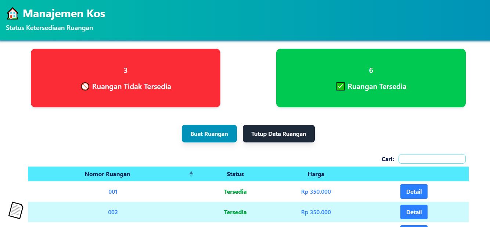
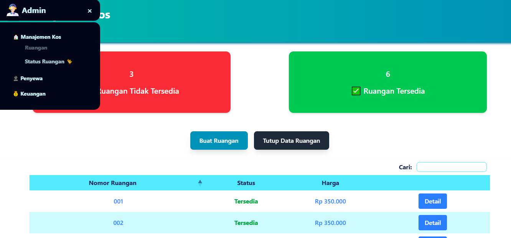

# Description

The Boarding House Admin System is a CMS-based application designed to help boarding house managers manage tenant data, room availability, and payment processes. This system consists of a backend using Laravel as a REST API and a frontend using React.

# Features

- Room Management: Add, edit, delete, and view room availability status.

- Tenant Management: Input tenant data and rental information.

- Payment System: Send payment tokens via WhatsApp and automatic confirmation.

- Admin Dashboard: Statistics on available and unavailable rooms.

- Search and Filter Data: Search for rooms or tenants based on specific cri

# Prerequisites
- Technologies Used

- Backend: Laravel 11

- Frontend: React.js

- Database: MySQL

- Authentication: Laravel Sanctum

- Messaging: WhatsApp API
## Run Locally

Clone the repository or download the project directly from GitHub

```bash
  git clone https://github.com/komikodok/cms_admin-frontend
```

Install dependencies

```bash
  npm install
```




SideBar
